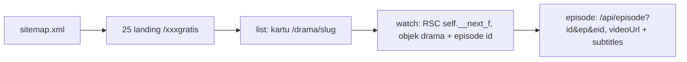

<div align="center">

# DramaStream + WebDracin Scraper

### Drama streaming web (Sub Indo) + scraper Node.js untuk webdracin.com — serverless, siap deploy ke Vercel

[](https://nodejs.org)
[](https://vercel.com)
[](#daftar-25-platform)
[](./LICENSE)

**Satu repo, dua sumber tontonan: UI DramaStream (React) + data WebDracin (25 platform, Sub Indo) via serverless `api/*`. Tanpa Supabase, tanpa server always-on.**

[Deploy ke Vercel](#deploy-ke-vercel) · [Struktur](#struktur) · [API](#api-serverless) · [CLI Scraper](#mulai-cepat-cli) · [Donasi](#buy-me-a-coffee)

</div>

---

## Deploy ke Vercel

Repo ini **sudah siap upload ke Vercel** — tidak perlu setting build manual:

| Setting (otomatis dari `vercel.json`) | Nilai |
| --- | --- |
| Framework | Vite |
| Build command | `npm run build` |
| Output directory | `dist` |
| Functions | `api/*.js` (Node serverless) |
| Env vars | **tidak wajib** — proxy default ke `/api/dramabox-proxy` satu deploy yang sama |

**Cara 1 — via GitHub (disarankan):**

```bash
git add -A
git commit -m "combined dramastream + webdracin, serverless on vercel"
git push origin main   # atau branch kamu
```

Lalu di dashboard Vercel → **Add New Project** → Import repo → **Deploy**.
Tidak perlu isi Environment Variables.

**Cara 2 — via CLI:**

```bash
npm i -g vercel
vercel        # preview deploy
vercel --prod # production
```

**Env opsional** (hanya jika masih mau pakai Supabase edge function lama):

```bash
VITE_SUPABASE_URL=https://<project>.supabase.co
# atau proxy custom:
VITE_PROXY_BASE=/api/dramabox-proxy
```

Lihat `.env.example`.

## Struktur

```
.
├── api/                      # Vercel serverless functions (Node ESM)
│   ├── _lib/common.js        # CORS + helper kirim JSON + preset cache edge
│   ├── platforms.js          # GET /api/platforms
│   ├── platform-status.js    # GET /api/platform-status
│   ├── list.js               # GET /api/list?platform=&limit=
│   ├── all.js                # GET /api/all?limitPerPlatform=
│   ├── search.js             # GET /api/search?q=&limit=
│   ├── drama.js              # GET /api/drama?slug=
│   ├── watch.js              # GET /api/watch?slug=
│   ├── episode.js            # GET /api/episode?id=&ep=&eid= (signed URL, cache singkat)
│   ├── full.js               # GET /api/full?slug=&eps=
│   ├── proxy.js              # GET /api/proxy?url=&type= (subtitle/cover/video anti-CORS)
│   ├── img.js                # GET /api/img?url= (proxy cover, edge-cache 7 hari)
│   ├── dramabox-proxy.js     # GET /api/dramabox-proxy?... (pengganti Supabase edge fn)
│   ├── health.js             # GET /api/health
│   └── cache-clear.js        # GET /api/cache-clear (no-op kompatibilitas)
├── src/                      # Frontend DramaStream (React + Vite + Tailwind + shadcn)
│   ├── lib/api.ts            # Client API drama (default via /api/dramabox-proxy)
│   ├── lib/webdracin.ts      # Client baru: /api/* scraper webdracin
│   └── pages/Dracin.tsx      # Browse 25 platform Sub Indo (/dracin)
├── public/classic/           # UI vanilla DracinPlay lama (/classic/)
├── scrape.cjs                # Scraper CLI + library (dipakai api/* via import)
├── server.cjs                # Server lokal always-on (dev vanilla, bukan untuk Vercel)
├── index.html                # Entry Vite
└── vercel.json               # Build + rewrite SPA + proxy /classic/api → /api
```

**Catatan rename:** `scrape.js` → `scrape.cjs` dan `server.js` → `server.cjs`
karena `package.json` sekarang `"type": "module"` (butuh ESM untuk Vite).
Perintah CLI menjadi `node scrape.cjs ...`.

## UI

| Route | Isi |
| --- | --- |
| `/` | DramaStream: Trending, For You, Latest + row baru **🎭 DracinPlay • Sub Indo** |
| `/dracin` | Browse 25 platform webdracin (chip platform + grid) |
| `/drama/webdracin/:slug` | Detail + daftar episode (sumber webdracin) |
| `/watch/webdracin/:id/:eid` | Player + subtitle Indo otomatis |
| `/search` | Cari semua sumber + tab filter **Dracin Sub Indo** |
| `/classic/` | UI vanilla DracinPlay lama (tetap jalan di atas `/api/*`) |

## API (serverless)

Semua `GET`, CORS `*`, cache via edge (`s-maxage`):

```
GET /api/health
GET /api/platforms
GET /api/platform-status            # [{platform, ok}] (maxDuration 60s)
GET /api/list?platform=dramabox&limit=24
GET /api/all?limitPerPlatform=5     # terberat, maxDuration 60s
GET /api/search?q=cinta&limit=24
GET /api/drama?slug=
GET /api/watch?slug=
GET /api/episode?id=&ep=&eid=       # URL signed, cache 60 detik saja
GET /api/full?slug=&eps=3
GET /api/proxy?url=<encoded>&type=vtt|img|video
GET /api/img?url=<encoded>
GET /api/dramabox-proxy?endpoint=&source=&params=   # dramabox|melolo|netshort|dramadash|...
GET /api/dramabox-proxy?videoUrl=<encoded>          # proxy video (m3u8-aware)
GET /api/dramabox-proxy?imageUrl=<encoded>
```

## Dev lokal

```bash
npm install

npm run dev          # frontend DramaStream → http://localhost:8080
                     # (Vite proxy? belum — /api butuh backend, lihat bawah)

node server.cjs      # backend vanilla + frontend classic → http://localhost:3000
```

`npm run dev` + `node server.cjs` jalan bareng saat develop UI React
(atau `vercel dev` untuk emulasi serverless + frontend sekaligus).

## Streaming Web Klasik (DracinPlay vanilla)

Tetap tersedia di `/classic/` (deploy) atau `node server.cjs` (lokal):

- Beranda + 25 chip platform, pencarian judul, hero unggulan.
- Halaman detail: sinopsis, cover, daftar semua episode.
- Halaman nonton: player vertikal 9:16, subtitle Indonesia otomatis,
  tombol Prev/Next + auto-next, salin URL stream (mpv/VLC), unduh,
  favorit & lanjutkan nonton (localStorage).
- `scrape.cjs` tetap CLI seperti semula, plus `module.exports`
  sehingga `server.cjs` dan `api/*` memakai fungsi yang sama.

## Mulai Cepat (CLI)

Butuh Node.js 18+:

```bash
node --version
```

Tanpa `npm install`:

```bash
# 1. Daftar platform
node scrape.cjs platforms

# 2. Ambil 5 drama Dramabox
node scrape.cjs list --platform dramabox --limit 5

# 3. Detail + stream 1 drama
node scrape.cjs full pesona-kupu-kupu-malam-melolo-7382543104621939728 --eps 2 --out out/full.json
```

## Perintah

### `platforms`: daftar 25 platform

```bash
node scrape.cjs platforms
```

```json
["dramabox", "cashdrama", "shotshort", "dramabite", "dramapops", ...]
```

### `list`: daftar drama

```bash
node scrape.cjs list --platform <nama> --limit <N> --out <file>
```

| Flag | Default | Keterangan |
| --- | --- | --- |
| `--platform` | homepage | Nama platform (`dramabox`, `melolo`, `reelshort`, ...). Kosongkan untuk homepage. |
| `--limit` | `50` | Jumlah drama. |
| `--out` | — | Tulis JSON ke file. |

```bash
node scrape.cjs list --platform reelshort --limit 3 --out out/reelshort.json
node scrape.cjs list --limit 10 --out out/home.json
```

### `all`: sapu 25 platform sekaligus

```bash
node scrape.cjs all --limitPerPlatform 5 --out out/semua.json
```

### `search`: cari judul

```bash
node scrape.cjs search "cinta" --limit 20 --out out/cari.json
```

### `drama`: metadata ringkas

```bash
node scrape.cjs drama kembalinya-sang-ratu-perang-dramabox-42000026892
```

### `watch`: detail + semua episode

```bash
node scrape.cjs watch kembalinya-sang-ratu-perang-dramabox-42000026892 --out out/watch.json
```

Setiap episode membawa `id` (eid) untuk ambil stream.
`videoUrl` di sini selalu `null` (data awal server). Panggil `episode` untuk URL asli.

### `episode`: URL stream

```bash
node scrape.cjs episode "dramabox:42000026892" 1 "701581759"
```

### `full`: paket watch + stream N episode pertama

```bash
node scrape.cjs full <slug> --eps 3 --out out/full.json
```

## Daftar 25 Platform

| # | Platform | Landing | Stream |
| --- | --- | --- | --- |
| 1 | dramabox | `/dramaboxgratis` | Yes |
| 2 | cashdrama | `/cashdramagratis` | Yes |
| 3 | shotshort | `/shotshortgratis` | Server null |
| 4 | dramabite | `/dramabitegratis` | Yes |
| 5 | dramapops | `/dramapopsgratis` | Yes |
| 6 | netshort | `/netshortgratis` | Yes |
| 7 | playlet | `/playletgratis` | Yes |
| 8 | flareflow | `/flareflowgratis` | Yes |
| 9 | reelshort | `/reelshortgratis` | Yes |
| 10 | dramadash | `/dramadashgratis` | Server null |
| 11 | dramamax | `/dramamaxgratis` | Server null |
| 12 | dramawave | `/dramawavegratis` | Yes |
| 13 | vigloo | `/vigloogratis` | Server null |
| 14 | velolo | `/velologratis` | Server null |
| 15 | cubetv | `/cubetvgratis` | Server null |
| 16 | minutedrama | `/minutedramagratis` | Server null |
| 17 | rapidtv | `/rapidtvgratis` | Server null |
| 18 | dramanova | `/dramanovagratis` | Yes |
| 19 | freereels | `/freereelsgratis` | Yes |
| 20 | melolo | `/melologratis` | Yes |
| 21 | flextv | `/flextvgratis` | Yes |
| 22 | dramarush | `/dramarushgratis` | Yes |
| 23 | shortbox | `/shortboxgratis` | Yes |
| 24 | radreels | `/radreelsgratis` | Yes |
| 25 | flickreels | `/flickreelsgratis` | Yes |

Yes = `videoUrl` aktif. Server null = server mengembalikan `videoUrl: null`, metadata dan subtitle tetap ada.

## Cara Kerja



1. Homepage hanya render 1 platform (tab aktif). Tab lain load di client, jadi scraper baca tiap landing `/{platform}gratis` langsung.
2. Halaman `/watch` menanam objek `drama` di payload React Server Component (`self.__next_f.push`). Scraper decode dan potong JSON-nya tanpa browser.
3. HTML tidak memuat URL video. Player frontend fetch `/api/episode?id=<dramaId>&ep=<n>&eid=<id>`, scraper memanggil endpoint yang sama.
4. Di Vercel, `api/*` adalah serverless function stateless: cache via header `s-maxage` (edge), bukan memori/disk. `/api/img` tidak lagi cache disk 7 hari — diganti edge cache.

## Troubleshooting

| Gejala | Penyebab | Solusi |
| --- | --- | --- |
| `drama object not found in RSC` | Slug salah / halaman pindah | Ambil slug baru dari `list` |
| `api/episode HTTP 4xx/5xx` | Rate limit sesaat | Tunggu, ulangi |
| `videoUrl: null` | Upstream platform kosong | Coba episode / platform lain |
| Cover `x-expires` basi | URL proxy bertanda waktu | Pakai `cover_real`, refresh berkala |
| `/api/all` timeout di Vercel | 25 fetch paralel > limit paket | Kecilkan `limitPerPlatform`, atau upgrade plan (maxDuration) |
| Build gagal `Failed to load native binding` | `@vitejs/plugin-react-swc` butuh biner SWC | Sudah diganti `@vitejs/plugin-react` (Babel, murni JS) |

## Disclaimer

Pakai untuk riset dan arsip pribadi. Patuhi syarat layanan webdracin.com dan hak pemegang konten. Jangan reupload karya berhak cipta.

## Buy Me a Coffee

Scraper ini membantumu? Traktir kopi:

<div align="center">

[](https://warungerik.com/payment)

</div>
