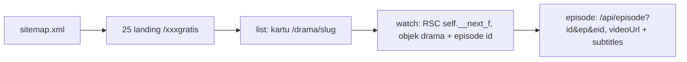

<div align="center">

# WebDracin Scraper

### Scraper Node.js tanpa dependency untuk webdracin.com

[](https://nodejs.org)
[](./scrape.js)
[](#daftar-25-platform)
[](./LICENSE)
[](#perintah)

**Tarik daftar drama, sinopsis, episode, subtitle Indonesia, dan URL stream (m3u8/mp4) dari 25 platform WebDracin dalam satu file, tanpa install apa pun.**

[Mulai](#mulai-cepat) · [Perintah](#perintah) · [Hasil Test](#hasil-test-25-platform) · [Donasi](#buy-me-a-coffee)

</div>

---

## Fitur

| Fitur | Keterangan |
| --- | --- |
| **Zero dependency** | `fetch` bawaan Node 18+. Tanpa cheerio, puppeteer, axios. |
| **25 platform** | `sitemap.xml` memberi daftar semua landing `/{platform}gratis`. |
| **Detail drama** | Judul, sinopsis, cover, jumlah episode, daftar episode + ID. |
| **Stream** | `/api/episode` memberi `videoUrl` per episode, siap putar/unduh. |
| **Subtitle** | Setiap episode membawa track subtitle Indonesia kalau ada. |
| **Output JSON** | Cetak ke stdout atau tulis ke file lewat `--out`. |

## Teknologi

<div align="center">


</div>

Tiga fungsi bawaan Node mengerjakan semua:

```js
fetch()              // HTTP client, pengganti axios/got
RegExp + matchAll()  // parsing HTML, pengganti cheerio
JSON.parse()         // decode payload React Server Component Next.js
```

## Struktur

```
webdracin/
├── scrape.js          # file utama
├── README.md
├── LICENSE
└── out/               # JSON hasil scrape (--out menulis ke sini)
    ├── list.json
    ├── watch.json
    └── test_log.json
```

## Mulai Cepat

Butuh Node.js 18+:

```bash
node --version
```

Tanpa `npm install`:

```bash
# 1. Daftar platform
node scrape.js platforms

# 2. Ambil 5 drama Dramabox
node scrape.js list --platform dramabox --limit 5

# 3. Detail + stream 1 drama
node scrape.js full pesona-kupu-kupu-malam-melolo-7382543104621939728 --eps 2 --out out/full.json
```

## Perintah

### `platforms`: daftar 25 platform

```bash
node scrape.js platforms
```

```json
["dramabox", "cashdrama", "shotshort", "dramabite", "dramapops", ...]
```

### `list`: daftar drama

```bash
node scrape.js list --platform <nama> --limit <N> --out <file>
```

| Flag | Default | Keterangan |
| --- | --- | --- |
| `--platform` | homepage | Nama platform (`dramabox`, `melolo`, `reelshort`, ...). Kosongkan untuk homepage. |
| `--limit` | `50` | Jumlah drama. |
| `--out` | — | Tulis JSON ke file. |

```bash
node scrape.js list --platform reelshort --limit 3 --out out/reelshort.json
node scrape.js list --limit 10 --out out/home.json
```

### `all`: sapu 25 platform sekaligus

```bash
node scrape.js all --limitPerPlatform 5 --out out/semua.json
```

Hasilnya objek per platform:

```json
{
  "dramabox": [ { "slug": "...", "title": "..." } ],
  "melolo": [ { "slug": "...", "title": "..." } ]
}
```

### `search`: cari judul

```bash
node scrape.js search "cinta" --limit 20 --out out/cari.json
```

### `drama`: metadata ringkas

```bash
node scrape.js drama kembalinya-sang-ratu-perang-dramabox-42000026892
```

```json
{
  "slug": "kembalinya-sang-ratu-perang-dramabox-42000026892",
  "url": "https://webdracin.com/drama/kembalinya-sang-ratu-perang-dramabox-42000026892",
  "title": "Kembalinya Sang Ratu Perang",
  "synopsis": "Menyembunyikan statusnya sebagai Dewi Perang...",
  "episodeCount": 46,
  "watch_url": "https://webdracin.com/watch/kembalinya-sang-ratu-perang-dramabox-42000026892?ep=1"
}
```

### `watch`: detail + semua episode

```bash
node scrape.js watch kembalinya-sang-ratu-perang-dramabox-42000026892 --out out/watch.json
```

Setiap episode membawa `id` (eid) untuk ambil stream:

```json
{
  "dramaId": "dramabox:42000026892",
  "title": "Kembalinya Sang Ratu Perang",
  "episodeCount": 46,
  "episodes": [
    { "id": "701581759", "number": 1, "label": "EP 1", "free": true, "videoUrl": null }
  ]
}
```

`videoUrl` di sini selalu `null` (data awal server). Panggil `episode` untuk URL asli.

### `episode`: URL stream

```bash
node scrape.js episode "dramabox:42000026892" 1 "701581759"
```

```json
{
  "videoUrl": "https://dramabox.backengine.web.id/api/stream?bookId=42000026892&episode=1&lang=in&seg=video.mp4&k=...",
  "subtitles": []
}
```

Ambil URL-nya saja untuk mpv/VLC:

```bash
node scrape.js episode "dramabox:42000026892" 1 "701581759" | node -e "let s='';process.stdin.on('data',d=>s+=d).on('end',()=>console.log(JSON.parse(s).videoUrl))"
```

### `full`: paket watch + stream N episode pertama

```bash
node scrape.js full <slug> --eps 3 --out out/full.json
```

## Daftar 25 Platform

| # | Platform | Landing | Stream |
| --- | --- | --- | --- |
| 1 | dramabox | `/dramaboxgratis` | Yes |
| 2 | cashdrama | `/cashdramagratis` | Yes |
| 3 | shotshort | `/shotshortgratis` | Server null |
| 4 | dramabite | `/dramabitegratis` | Yes |
| 5 | dramapops | `/dramapopsgratis` | Yes |
| 6 | netshort | `/netshortgratis` | Yes |
| 7 | playlet | `/playletgratis` | Yes |
| 8 | flareflow | `/flareflowgratis` | Yes |
| 9 | reelshort | `/reelshortgratis` | Yes |
| 10 | dramadash | `/dramadashgratis` | Server null |
| 11 | dramamax | `/dramamaxgratis` | Server null |
| 12 | dramawave | `/dramawavegratis` | Yes |
| 13 | vigloo | `/vigloogratis` | Server null |
| 14 | velolo | `/velologratis` | Server null |
| 15 | cubetv | `/cubetvgratis` | Server null |
| 16 | minutedrama | `/minutedramagratis` | Server null |
| 17 | rapidtv | `/rapidtvgratis` | Server null |
| 18 | dramanova | `/dramanovagratis` | Yes |
| 19 | freereels | `/freereelsgratis` | Yes |
| 20 | melolo | `/melologratis` | Yes |
| 21 | flextv | `/flextvgratis` | Yes |
| 22 | dramarush | `/dramarushgratis` | Yes |
| 23 | shortbox | `/shortboxgratis` | Yes |
| 24 | radreels | `/radreelsgratis` | Yes |
| 25 | flickreels | `/flickreelsgratis` | Yes |

Yes = `videoUrl` aktif. Server null = server mengembalikan `videoUrl: null`, metadata dan subtitle tetap ada.

## Cara Kerja



1. Homepage hanya render 1 platform (tab aktif). Tab lain load di client, jadi scraper baca tiap landing `/{platform}gratis` langsung.
2. Halaman `/watch` menanam objek `drama` di payload React Server Component (`self.__next_f.push`). Scraper decode dan potong JSON-nya tanpa browser.
3. HTML tidak memuat URL video. Player frontend fetch `/api/episode?id=<dramaId>&ep=<n>&eid=<id>`, scraper memanggil endpoint yang sama.

## Hasil Test 25 Platform

Alur uji: list 2 drama, watch drama pertama, stream EP 1 + EP 2.

**17 OK:** dramabox, cashdrama, dramabite, dramapops, netshort, playlet, flareflow, reelshort, dramawave, dramanova, freereels, melolo, flextv, dramarush, shortbox, radreels, flickreels.

**8 null dari server** (subtitle Indo tetap ada di 5 platform): shotshort, dramadash, dramamax, vigloo, velolo, cubetv, minutedrama, rapidtv.

## Troubleshooting

| Gejala | Penyebab | Solusi |
| --- | --- | --- |
| `drama object not found in RSC` | Slug salah / halaman pindah | Ambil slug baru dari `list` |
| `api/episode HTTP 4xx/5xx` | Rate limit sesaat | Tunggu, ulangi |
| `videoUrl: null` | Upstream platform kosong | Coba episode / platform lain |
| Cover `x-expires` basi | URL proxy bertanda waktu | Pakai `cover_real`, refresh berkala |

## Disclaimer

Pakai untuk riset dan arsip pribadi. Patuhi syarat layanan webdracin.com dan hak pemegang konten. Jangan reupload karya berhak cipta.

## Buy Me a Coffee

Scraper ini membantumu? Traktir kopi:

<div align="center">

[](https://warungerik.com/payment)

**[warungerik.com/payment](https://warungerik.com/payment)**

</div>
